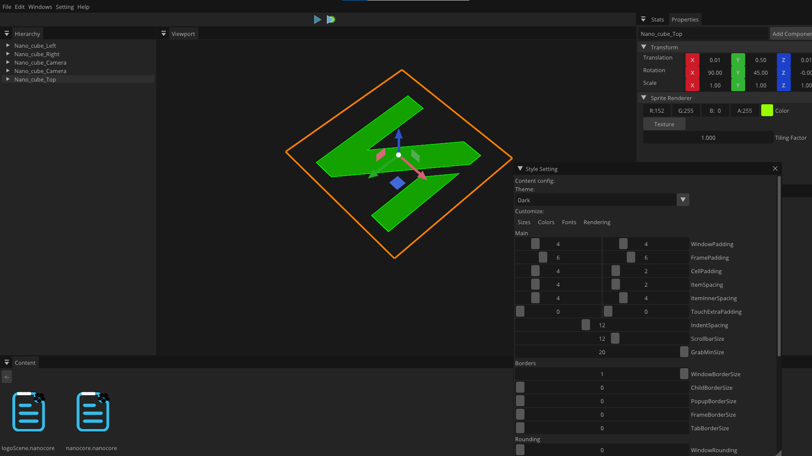

# NanoCore
A platform-cross game engine for myself.


### Introduction

### Name

**Nanocore**

An animation in china.


### Usage

```shell
git clone https://github.com/Haruluya/NanoCore.git
```

**NanoCore**

Engine part.

**NanoCore-Editor**

Editor part.

**NanoCore-UI**

Some ui components classes.


### Presentation




### Contact Author 

### License


